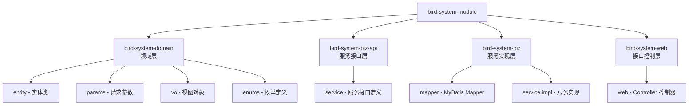

# Bird System Module 业务模块分析文档

> 📅 生成时间: 2026-04-17  
> 📦 扫描路径: `D:\SOSA_project\bird\bird-module\bird-system-module`

---

## 一、模块架构概览



| 子模块 | 包路径 | 职责 |
|--------|--------|------|
| **bird-system-domain** | `com.bird.system.domain` | 领域模型：实体、参数、VO、枚举 |
| **bird-system-biz-api** | `com.bird.system.service` | 服务接口定义（`IXxxService`） |
| **bird-system-biz** | `com.bird.system` | Mapper + Service 实现 |
| **bird-system-web** | `com.bird.system.web` | REST 控制器（含后台管理 + 小程序App端） |

> [!NOTE]
> 控制器分为两类：`/system/*` 为后台管理端接口，`/app/*` 为小程序/移动端接口。

---

## 二、业务模块分类

### 2.1 系统基础模块（Sys 前缀）

| 模块 | 实体类 | 表名 | 说明 |
|------|--------|------|------|
| 用户管理 | `SysUserEntity` | `sys_user` | 后台系统用户 |
| 部门管理 | `SysDeptEntity` | `sys_dept` | 组织部门树形结构 |
| 角色管理 | `SysRoleEntity` | `sys_role` | 角色权限控制 |
| 菜单管理 | `SysMenuEntity` | `sys_menu` | 菜单权限树 |
| 岗位管理 | `SysPostEntity` | `sys_post` | 岗位/职位 |
| 参数配置 | `SysConfigEntity` | `sys_config` | 系统参数键值对 |
| 字典类型 | `SysDictTypeEntity` | `sys_dict_type` | 字典分类 |
| 字典数据 | `SysDictDataEntity` | `sys_dict_data` | 字典键值数据 |
| 通知公告 | `SysNoticeEntity` | `sys_notice` | 通知/公告管理 |
| 操作日志 | `SysOperLogEntity` | `sys_oper_log` | 操作审计日志 |
| 登录日志 | `SysLogininforEntity` | `sys_logininfor` | 登录访问记录 |
| 异常日志 | `SysErrorLogEntity` | `sys_error_log` | 异常错误日志 |
| 在线用户 | `SysUserOnlineEntity` | - | 当前在线会话（非持久化） |
| 编码规则 | `SysCodeRuleEntity` | `sys_code_rule` | 编号自动生成规则 |
| 敏感词 | `SysSensitiveWordEntity` | `sys_sensitive_word` | 敏感词过滤 |

### 2.2 业务功能模块（Lx 前缀）

| 模块 | 实体类 | 表名 | 说明 |
|------|--------|------|------|
| 活动管理 | `LxActivityEntity` | `lx_activity` | 协会活动创建与发布 |
| 活动报名 | `LxSignEntity` | `lx_sign` | 活动报名记录 |
| 文章管理 | `LxArticleEntity` | `lx_article` | 文章/资讯发布 |
| 留学资讯 | `LxInformationEntity` | `lx_information` | 留学信息管理 |
| 推文管理 | `LxTweetEntity` | `lx_tweet` | 推文内容(政策/招聘等) |
| 视频管理 | `LxVideoEntity` | `lx_video` | 视频号资源管理 |
| 微信用户 | `LxWxuserEntity` | `lx_wxuser` | 微信小程序用户信息 |
| 会员卡管理 | `LxVipEntity` | `lx_vip` | VIP 会员卡 |
| 福利管理 | `LxWelfareEntity` | `lx_welfare` | 福利/代金券 |
| 卡包管理 | `LxCardEntity` | `lx_card` | 用户持有的卡包 |
| Banner管理 | `LxUserBannerEntity` | `lx_user_banner` | 首页轮播图 |
| 金刚区管理 | `LxUserJinEntity` | `lx_user_jin` | 首页金刚区快捷入口 |
| 成员管理 | `LxUserManagerEntity` | `lx_user_manager` | 协会成员信息 |
| 协会介绍 | `LxXiehuiEntity` | `lx_xiehui` | 协会简介 |
| 入会须知 | `LxRuhuiEntity` | `lx_ruhui` | 入会须知说明 |

---

## 三、实体字段详情

### 3.1 系统用户 - SysUserEntity

> 表名: `sys_user`

| 字段名 | 类型 | 说明 |
|--------|------|------|
| `id` | Long | 主键 (AUTO) |
| `orderNumber` | Long | 序号 |
| `userName` | String | 用户账号 |
| `nickName` | String | 用户昵称 |
| `email` | String | 用户邮箱 |
| `phonenumber` | String | 手机号码 |
| `sex` | String | 用户性别（枚举 `SexEnum`） |
| `avatar` | String | 用户头像 |
| `backgroundUrl` | String | 背景图 |
| `password` | String | 密码 |
| `status` | String | 帐号状态（0正常 1停用） |
| `delFlag` | String | 删除标志（逻辑删除） |
| `loginIp` | String | 最后登陆IP |
| `loginDate` | Date | 最后登陆时间 |
| `companyRemark` | String | 公司名称 |
| `jobRemark` | String | 职务 |
| `societyJobRemark` | String | 社会职务 |
| `honorRemark` | String | 荣誉 |
| `studyArea` | String | 留学领域 |
| `graduationSchool` | String | 毕业学校 |
| `theLevelId` | String | 等级ID |
| `createBy` / `createTime` | String / Date | 创建者/时间 |
| `updateBy` / `updateTime` | String / Date | 更新者/时间 |

> 非持久化关联字段: `dept`(部门), `roles`(角色列表), `roleIds`, `postIds`, `deptIds`, `postList`

---

### 3.2 部门管理 - SysDeptEntity

> 表名: `sys_dept`

| 字段名 | 类型 | 说明 |
|--------|------|------|
| `id` | Long | 主键 |
| `parentId` | Long | 父部门ID |
| `ancestors` | String | 祖级列表 |
| `deptName` | String | 部门名称 |
| `orderNum` | String | 显示顺序 |
| `leader` | String | 负责人 |
| `phone` | String | 联系电话 |
| `email` | String | 邮箱 |
| `showRole` | String | 展示的角色 |
| `status` | String | 部门状态(0正常 1停用) |
| `delFlag` | String | 删除标志 |

---

### 3.3 角色管理 - SysRoleEntity

> 表名: `sys_role`

| 字段名 | 类型 | 说明 |
|--------|------|------|
| `id` | Long | 角色ID |
| `roleName` | String | 角色名称 |
| `roleKey` | String | 角色权限标识 |
| `roleSort` | String | 角色排序 |
| `dataScope` | String | 数据范围(1全部;2自定义;3本部门;4本部门及以下) |
| `menuCheckStrictly` | Boolean | 菜单树关联显示 |
| `deptCheckStrictly` | Boolean | 部门树关联显示 |
| `status` | String | 状态(0正常 1停用) |
| `delFlag` | String | 删除标志 |
| `remark` | String | 备注 |

---

### 3.4 菜单管理 - SysMenuEntity

> 表名: `sys_menu`

| 字段名 | 类型 | 说明 |
|--------|------|------|
| `id` | Long | 主键 |
| `menuName` | String | 菜单名称 |
| `parentId` | Long | 父菜单ID |
| `orderNum` | Integer | 显示顺序 |
| `path` | String | 路由地址 |
| `component` | String | 组件路径 |
| `query` | String | 路由参数 |
| `isFrame` | String | 是否外链(0是 1否) |
| `isCache` | String | 是否缓存(0缓存 1不缓存) |
| `menuType` | String | 类型(M目录 C菜单 F按钮) |
| `visible` | String | 显示状态(0显示 1隐藏) |
| `status` | String | 菜单状态 |
| `perms` | String | 权限字符串 |
| `icon` | String | 菜单图标 |

---

### 3.5 岗位管理 - SysPostEntity

> 表名: `sys_post`

| 字段名 | 类型 | 说明 |
|--------|------|------|
| `id` | Long | 主键 |
| `postCode` | String | 岗位编码 |
| `postName` | String | 岗位名称 |
| `postSort` | String | 岗位排序 |
| `status` | String | 状态(0正常 1停用) |
| `remark` | String | 备注 |

---

### 3.6 参数配置 - SysConfigEntity

> 表名: `sys_config`

| 字段名 | 类型 | 说明 |
|--------|------|------|
| `id` | Long | 主键 |
| `configName` | String | 参数名称 |
| `configKey` | String | 参数键名 |
| `configValue` | String | 参数键值 |
| `configType` | String | 系统内置(Y是 N否) |
| `remark` | String | 备注 |

---

### 3.7 字典类型 - SysDictTypeEntity

> 表名: `sys_dict_type`

| 字段名 | 类型 | 说明 |
|--------|------|------|
| `id` | Long | 主键 |
| `dictName` | String | 字典名称 |
| `dictType` | String | 字典类型 |
| `status` | String | 状态 |
| `remark` | String | 备注 |

---

### 3.8 字典数据 - SysDictDataEntity

> 表名: `sys_dict_data`

| 字段名 | 类型 | 说明 |
|--------|------|------|
| `id` | Long | 主键 |
| `dictSort` | Long | 字典排序 |
| `dictLabel` | String | 字典标签 |
| `dictValue` | String | 字典键值 |
| `dictType` | String | 字典类型 |
| `cssClass` | String | 样式属性 |
| `listClass` | String | 表格字典样式 |
| `isDefault` | String | 是否默认(Y/N) |
| `status` | String | 状态 |

---

### 3.9 通知公告 - SysNoticeEntity

> 表名: `sys_notice`

| 字段名 | 类型 | 说明 |
|--------|------|------|
| `id` | Long | 主键 |
| `noticeTitle` | String | 公告标题 |
| `noticeType` | String | 公告类型(1通知 2公告) |
| `noticeUrl` | String | 公告图片 |
| `noticeContent` | String | 公告内容 |
| `status` | String | 公告状态(0正常 1关闭) |
| `remark` | String | 备注 |

---

### 3.10 操作日志 - SysOperLogEntity

> 表名: `sys_oper_log`

| 字段名 | 类型 | 说明 |
|--------|------|------|
| `id` | Long | 主键 (ASSIGN_ID) |
| `title` | String | 操作模块 |
| `businessType` | Integer | 业务类型(0其它 1新增 2修改 3删除) |
| `method` | String | 请求方法 |
| `requestMethod` | String | 请求方式 |
| `operatorType` | Integer | 操作类别(0其它 1后台 2手机端) |
| `operName` | String | 操作人员 |
| `deptName` | String | 部门名称 |
| `operUrl` | String | 请求URL |
| `operIp` | String | 操作IP地址 |
| `operLocation` | String | 操作地点 |
| `operParam` | String | 请求参数 |
| `jsonResult` | String | 返回参数 |
| `status` | Integer | 操作状态(0正常 1异常) |
| `errorMsg` | String | 错误消息 |
| `operTime` | Date | 操作时间 |
| `spendTime` | Long | 耗时(ms) |

---

### 3.11 登录日志 - SysLogininforEntity

> 表名: `sys_logininfor`

| 字段名 | 类型 | 说明 |
|--------|------|------|
| `id` | Long | 主键 |
| `userName` | String | 用户账号 |
| `loginType` | String | 登录类型 |
| `status` | String | 登录状态(0成功 1失败) |
| `ipaddr` | String | 登录IP |
| `loginLocation` | String | 登录地点 |
| `browser` | String | 浏览器类型 |
| `os` | String | 操作系统 |
| `msg` | String | 提示消息 |
| `loginTime` | Date | 访问时间 |

---

### 3.12 异常日志 - SysErrorLogEntity

> 表名: `sys_error_log`

| 字段名 | 类型 | 说明 |
|--------|------|------|
| `id` | Long | 主键 |
| `requestUri` | String | 请求URI |
| `requestMethod` | String | 请求方式 |
| `requestParams` | String | 请求参数 |
| `userAgent` | String | 用户代理 |
| `ip` | String | 操作IP |
| `ipAddress` | String | 操作IP地址 |
| `errorInfo` | String | 异常信息 |
| `errorSimpleInfo` | String | 简要异常信息 |
| `creator` | Long | 创建者 |
| `createDate` | Date | 创建时间 |
| `creatorName` | String | 创建人名 |

---

### 3.13 编码规则 - SysCodeRuleEntity

> 表名: `sys_code_rule`

| 字段名 | 类型 | 说明 |
|--------|------|------|
| `id` | Long | 主键 |
| `ruleName` | String | 规则名称 |
| `ruleCode` | String | 规则编码 |
| `rulePrefix` | String | 编码前缀 |
| `formatType` | String | 编码类型(1日期+随机;2日期+递增;3递增) |
| `formatStr` | String | 格式化格式 |
| `curFormatVal` | String | 当前日期 |
| `serialLen` | Integer | 序列占位长度 |
| `serial` | Integer | 当前序列值 |
| `deleted` | String | 删除标志 |

---

### 3.14 敏感词 - SysSensitiveWordEntity

> 表名: `sys_sensitive_word`

| 字段名 | 类型 | 说明 |
|--------|------|------|
| `id` | Long | 主键 |
| `words` | String | 敏感词 |
| `creTime` | Date | 创建时间 |
| `creSb` | Long | 创建人 |

---

### 3.15 活动管理 - LxActivityEntity

> 表名: `lx_activity`

| 字段名 | 类型 | 说明 |
|--------|------|------|
| `id` | Long | 主键 |
| `title` | String | 标题 |
| `startTime` | Date | 开始时间 |
| `endTime` | Date | 结束时间 |
| `address` | String | 地址 |
| `money` | BigDecimal | 金额 |
| `remark` | String | 活动内容 |
| `status` | String | 活动状态 |
| `avaterUrl` | String | 封面照片 |
| `labelName` | String | 标签名 |
| `contactName` | String | 联系人姓名 |
| `contactMobile` | String | 联系人手机 |
| `signQuota` | int | 报名人数限额 |
| `signType` | String | 报名人员类型 |
| `createTime` | Date | 创建时间 |
| `createBy` | Long | 创建人 |

---

### 3.16 活动报名 - LxSignEntity

> 表名: `lx_sign`

| 字段名 | 类型 | 说明 |
|--------|------|------|
| `id` | Long | 主键 |
| `userId` | Long | 报名人ID |
| `activityId` | Long | 活动ID |
| `createTime` | Date | 创建时间 |
| `createBy` | Long | 创建人 |

---

### 3.17 文章管理 - LxArticleEntity

> 表名: `lx_article`

| 字段名 | 类型 | 说明 |
|--------|------|------|
| `id` | Long | 主键 |
| `orderNumber` | Long | 顺序序号 |
| `title` | String | 标题 |
| `articleUrl` | String | 文章图片 |
| `type` | String | 文章类别 |
| `contentType` | String | 文章内容类别 |
| `remark` | String | 文章内容 |
| `createTime` | Date | 创建时间 |
| `createBy` | Long | 创建人 |

---

### 3.18 留学资讯 - LxInformationEntity

> 表名: `lx_information`

| 字段名 | 类型 | 说明 |
|--------|------|------|
| `id` | Long | 主键 |
| `orderNumber` | Long | 顺序序号 |
| `title` | String | 标题 |
| `informationUrl` | String | 留学资讯图片 |
| `informationContent` | String | 留学资讯内容 |
| `type` | String | 资讯类别 |
| `contentType` | String | 内容类别 |
| `remark` | String | 备注 |
| `createTime` | Date | 创建时间 |
| `createBy` | Long | 创建人 |

---

### 3.19 推文管理 - LxTweetEntity

> 表名: `lx_tweet`

| 字段名 | 类型 | 说明 |
|--------|------|------|
| `id` | Long | 主键 |
| `tweetTitle` | String | 推文标题 |
| `tweetType` | String | 推文类型 |
| `tweetContent` | String | 推文内容 |
| `tweetImg` | String | 推文列表图片 |
| `createTime` | Date | 创建时间 |
| `createBy` | Long | 创建人 |

---

### 3.20 视频管理 - LxVideoEntity

> 表名: `lx_video`

| 字段名 | 类型 | 说明 |
|--------|------|------|
| `id` | Long | 主键 |
| `title` | String | 标题 |
| `avaterUrl` | String | 图片地址 |
| `releases` | String | 发布状态(1发布 2不发布) |
| `feeldId` | String | 视频ID |
| `finderUserName` | String | 视频号ID |
| `remark` | String | 描述 |
| `createTime` | Date | 创建时间 |
| `createBy` | Long | 创建人 |

---

### 3.21 微信用户 - LxWxuserEntity

> 表名: `lx_wxuser`

| 字段名 | 类型 | 说明 |
|--------|------|------|
| `id` | Long | 主键 |
| `userName` | String | 用户昵称 |
| `userEnglishName` | String | 英文名 |
| `regDate` | Date | 注册日期 |
| `order` | String | 会员编号 |
| `liuxueGuo` | String | 留学国家 |
| `mobile` | String | 手机号 |
| `liuxueSchool` | String | 留学学校 |
| `major` | String | 专业/证书 |
| `certificate` | String | 证书 |
| `gender` | String | 性别 |
| `companyName` | String | 单位名称 |
| `vip` | String | 是否会员 |
| `companyPost` | String | 单位职位 |
| `companyAddress` | String | 单位地址 |
| `status` | String | 审核状态 |
| `remark` | String | 会员简介 |
| `post` | String | 社会职务 |
| `nickName` | String | 微信昵称 |
| `avaterUrl` | String | 头像地址 |
| `email` | String | 邮箱 |
| `jiguan` | String | 籍贯 |
| `birthday` | Date | 生日 |
| `wxopenid` | String | 微信OpenID |
| `archives` | String | 档案 |
| `createTime` | Date | 审核时间 |
| `createBy` | Long | 审核人 |

---

### 3.22 会员卡 - LxVipEntity

> 表名: `lx_vip`

| 字段名 | 类型 | 说明 |
|--------|------|------|
| `id` | Long | 主键 |
| `title` | String | 标题 |
| `avaterUrl` | String | 图片地址 |
| `membershipDescribe` | String | 会员描述 |
| `remark` | String | 描述 |
| `rule` | String | 使用规则 |
| `startTime` | Date | 开始时间 |
| `endTime` | Date | 结束时间 |
| `createTime` | Date | 创建时间 |
| `createBy` | Long | 创建人 |

---

### 3.23 福利管理 - LxWelfareEntity

> 表名: `lx_welfare`

| 字段名 | 类型 | 说明 |
|--------|------|------|
| `id` | Long | 主键 |
| `title` | String | 标题 |
| `avaterUrl` | String | 图片地址 |
| `money` | BigDecimal | 金额 |
| `discountType` | String | 折扣方式 |
| `discount` | String | 折扣 |
| `remark` | String | 描述 |
| `rule` | String | 使用规则 |
| `startTime` | Date | 开始时间 |
| `endTime` | Date | 结束时间 |
| `createTime` | Date | 创建时间 |
| `createBy` | Long | 创建人 |

---

### 3.24 卡包管理 - LxCardEntity

> 表名: `lx_card`

| 字段名 | 类型 | 说明 |
|--------|------|------|
| `id` | Long | 主键 |
| `cardId` | Long | 会员卡/福利ID |
| `userId` | Long | 微信用户ID |
| `type` | String | 类型(1会员卡 2代金券) |
| `status` | String | 状态 |
| `useStatus` | String | 使用状态 |
| `createTime` | Date | 创建时间 |
| `createBy` | String | 创建人 |

---

### 3.25 Banner 管理 - LxUserBannerEntity

> 表名: `lx_user_banner`

| 字段名 | 类型 | 说明 |
|--------|------|------|
| `id` | Long | 主键 |
| `title` | String | 标题 |
| `avaterUrl` | String | 图片地址 |
| `releases` | String | 发布(1发布 2不发布) |
| `pointUrl` | String | 指向地址 |
| `createTime` | Date | 修改时间 |
| `createBy` | Long | 修改人 |

---

### 3.26 金刚区 - LxUserJinEntity

> 表名: `lx_user_jin`

| 字段名 | 类型 | 说明 |
|--------|------|------|
| `id` | Long | 主键 |
| `title` | String | 标题 |
| `avaterUrl` | String | 图片地址 |
| `remark` | String | 描述 |
| `releases` | String | 发布(1发布 2不发布) |
| `pointUrl` | String | 指向地址 |
| `createTime` | Date | 修改时间 |
| `createBy` | Long | 修改人 |

---

### 3.27 成员管理 - LxUserManagerEntity

> 表名: `lx_user_manager`

| 字段名 | 类型 | 说明 |
|--------|------|------|
| `id` | Long | 主键 |
| `userName` | String | 用户名称 |
| `avaterUrl` | String | 头像地址 |
| `regDate` | Date | 入职日期 |
| `mobile` | String | 手机号 |
| `remark` | String | 介绍 |
| `createTime` | Date | 创建时间 |
| `createBy` | Long | 创建人 |

---

### 3.28 协会介绍 - LxXiehuiEntity

> 表名: `lx_xiehui`

| 字段名 | 类型 | 说明 |
|--------|------|------|
| `id` | Long | 主键 |
| `title` | String | 标题 |
| `avaterUrl` | String | 图片地址 |
| `remark` | String | 描述 |
| `createTime` | Date | 新增时间 |
| `updateTime` | Date | 修改时间 |
| `createBy` | Long | 修改人 |

---

### 3.29 入会须知 - LxRuhuiEntity

> 表名: `lx_ruhui`

| 字段名 | 类型 | 说明 |
|--------|------|------|
| `id` | Long | 主键 |
| `title` | String | 标题 |
| `avaterUrl` | String | 图片地址 |
| `remark` | String | 描述 |
| `createTime` | Date | 新增时间 |
| `updateTime` | Date | 修改时间 |
| `createBy` | Long | 修改人 |

---

## 四、服务接口定义

### 4.1 系统模块服务接口

| 接口名 | 说明 |
|--------|------|
| `ISysUserService` | 系统用户服务 |
| `ISysDeptService` | 部门管理服务 |
| `ISysRoleService` | 角色管理服务 |
| `ISysMenuService` | 菜单权限服务 |
| `ISysPostService` | 岗位管理服务 |
| `ISysConfigService` | 参数配置服务 |
| `ISysDictTypeService` | 字典类型服务 |
| `ISysDictDataService` | 字典数据服务 |
| `ISysNoticeService` | 通知公告服务 |
| `ISysOperLogService` | 操作日志服务 |
| `ISysLogininforService` | 登录日志服务 |
| `ISysErrorLogService` | 异常日志服务 |
| `ISysUserOnlineService` | 在线用户服务 |
| `ISysCodeRuleService` | 编码规则服务 |
| `ISysSensitiveWordService` | 敏感词服务 |
| `ISortTableService` | 排序服务 |

### 4.2 业务模块服务接口

| 接口名 | 说明 |
|--------|------|
| `ILxActivityService` | 活动管理服务 |
| `ILxSignService` | 活动报名服务 |
| `ILxArticleService` | 文章管理服务 |
| `ILxInformationService` | 留学资讯服务 |
| `ILxTweetService` | 推文管理服务 |
| `ILxVideoService` | 视频管理服务 |
| `ILxWxuserService` | 微信用户服务 |
| `ILxVipService` | 会员卡服务 |
| `ILxWelfareService` | 福利管理服务 |
| `ILxCardService` | 卡包管理服务 |
| `ILxUserBannerService` | Banner 服务 |
| `ILxUserJinService` | 金刚区服务 |
| `ILxUserManagerService` | 成员管理服务 |
| `ILxXiehuiService` | 协会介绍服务 |
| `ILxRuhuiService` | 入会须知服务 |

---

## 五、REST API 接口清单

### 5.1 后台管理端接口 (`/system/*`)

#### 用户管理 - `/system/user`

| 方法 | 路径 | 说明 |
|------|------|------|
| GET | `/system/user/list` | 查询用户列表 |
| GET | `/system/user/export` | 导出用户数据 |
| GET | `/system/user/{userId}` | 获取用户详情 |
| POST | `/system/user` | 新增用户 |
| PUT | `/system/user` | 修改用户 |
| DELETE | `/system/user/{userIds}` | 删除用户 |
| PUT | `/system/user/resetPwd` | 重置密码 |
| PUT | `/system/user/changeStatus` | 修改状态 |
| GET | `/system/user/authRole/{userId}` | 获取授权角色 |
| PUT | `/system/user/authRole` | 修改授权角色 |

#### 个人信息 - `/system/user/profile`

| 方法 | 路径 | 说明 |
|------|------|------|
| GET | `/system/user/profile` | 获取个人信息 |
| PUT | `/system/user/profile` | 修改个人信息 |
| PUT | `/system/user/profile/updatePwd` | 修改密码 |
| POST | `/system/user/profile/avatar` | 上传头像 |

#### 部门管理 - `/system/dept`

| 方法 | 路径 | 说明 |
|------|------|------|
| GET | `/system/dept/list` | 查询部门列表 |
| GET | `/system/dept/{deptId}` | 获取部门详情 |
| POST | `/system/dept` | 新增部门 |
| PUT | `/system/dept` | 修改部门 |
| DELETE | `/system/dept/{deptId}` | 删除部门 |

#### 角色管理 - `/system/role`

| 方法 | 路径 | 说明 |
|------|------|------|
| GET | `/system/role/list` | 查询角色列表 |
| GET | `/system/role/export` | 导出角色数据 |
| GET | `/system/role/{roleId}` | 获取角色详情 |
| POST | `/system/role` | 新增角色 |
| PUT | `/system/role` | 修改角色 |
| PUT | `/system/role/dataScope` | 修改数据权限 |
| PUT | `/system/role/changeStatus` | 修改角色状态 |
| DELETE | `/system/role/{roleIds}` | 删除角色 |
| GET | `/system/role/optionselect` | 角色下拉选项 |
| GET | `/system/role/authUser/allocatedList` | 已分配用户列表 |
| GET | `/system/role/authUser/unallocatedList` | 未分配用户列表 |
| PUT | `/system/role/authUser/selectAll` | 批量授权用户 |
| PUT | `/system/role/authUser/cancel` | 取消用户授权 |
| PUT | `/system/role/authUser/cancelAll` | 批量取消授权 |

#### 菜单管理 - `/system/menu`

| 方法 | 路径 | 说明 |
|------|------|------|
| GET | `/system/menu/list` | 查询菜单列表 |
| GET | `/system/menu/{menuId}` | 获取菜单详情 |
| GET | `/system/menu/treeselect` | 菜单下拉树 |
| GET | `/system/menu/roleMenuTreeselect/{roleId}` | 角色菜单树 |
| POST | `/system/menu` | 新增菜单 |
| PUT | `/system/menu` | 修改菜单 |
| DELETE | `/system/menu/{menuId}` | 删除菜单 |

#### 岗位管理 - `/system/post`

| 方法 | 路径 | 说明 |
|------|------|------|
| GET | `/system/post/list` | 查询岗位列表 |
| GET | `/system/post/export` | 导出岗位数据 |
| GET | `/system/post/{postId}` | 获取岗位详情 |
| POST | `/system/post` | 新增岗位 |
| PUT | `/system/post` | 修改岗位 |
| DELETE | `/system/post/{postIds}` | 删除岗位 |
| GET | `/system/post/optionselect` | 岗位下拉选项 |

#### 参数配置 - `/system/config`

| 方法 | 路径 | 说明 |
|------|------|------|
| GET | `/system/config/list` | 查询参数列表 |
| GET | `/system/config/{configId}` | 获取参数详情 |
| POST | `/system/config` | 新增参数 |
| PUT | `/system/config` | 修改参数 |
| DELETE | `/system/config/{configIds}` | 删除参数 |

#### 字典类型 - `/system/dict/type`

| 方法 | 路径 | 说明 |
|------|------|------|
| GET | `/system/dict/type/list` | 查询字典类型列表 |
| GET | `/system/dict/type/{dictId}` | 获取字典类型详情 |
| POST | `/system/dict/type` | 新增字典类型 |
| PUT | `/system/dict/type` | 修改字典类型 |
| DELETE | `/system/dict/type/{dictIds}` | 删除字典类型 |

#### 字典数据 - `/system/dict/data`

| 方法 | 路径 | 说明 |
|------|------|------|
| GET | `/system/dict/data/list` | 查询字典数据列表 |
| GET | `/system/dict/data/{dictCode}` | 获取字典数据详情 |
| POST | `/system/dict/data` | 新增字典数据 |
| PUT | `/system/dict/data` | 修改字典数据 |
| DELETE | `/system/dict/data/{dictCodes}` | 删除字典数据 |

#### 通知公告 - `/system/notice`

| 方法 | 路径 | 说明 |
|------|------|------|
| GET | `/system/notice/list` | 查询通知列表 |
| GET | `/system/notice/{id}` | 获取通知详情 |
| POST | `/system/notice` | 新增通知 |
| PUT | `/system/notice` | 修改通知 |
| DELETE | `/system/notice/{ids}` | 删除通知 |

#### 活动管理 - `/system/activity`

| 方法 | 路径 | 说明 |
|------|------|------|
| GET | `/system/activity/list` | 查询活动列表 |
| GET | `/system/activity/export` | 导出活动数据 |
| GET | `/system/activity/{id}` | 获取活动详情 |
| POST | `/system/activity` | 新增活动 |
| PUT | `/system/activity` | 修改活动 |
| DELETE | `/system/activity/{ids}` | 删除活动 |

#### 活动报名 - `/system/sign`

| 方法 | 路径 | 说明 |
|------|------|------|
| GET | `/system/sign/list` | 查询报名列表 |
| GET | `/system/sign/{id}` | 获取报名详情 |
| POST | `/system/sign` | 新增报名 |
| PUT | `/system/sign` | 修改报名 |
| DELETE | `/system/sign/{ids}` | 删除报名 |

#### 文章管理 - `/system/article`

| 方法 | 路径 | 说明 |
|------|------|------|
| GET | `/system/article/list` | 查询文章列表 |
| GET | `/system/article/{id}` | 获取文章详情 |
| POST | `/system/article` | 新增文章 |
| PUT | `/system/article` | 修改文章 |
| DELETE | `/system/article/{ids}` | 删除文章 |

#### 推文管理 - `/system/tweet`

| 方法 | 路径 | 说明 |
|------|------|------|
| GET | `/system/tweet/list` | 查询推文列表 |
| GET | `/system/tweet/{id}` | 获取推文详情 |
| POST | `/system/tweet` | 新增推文 |
| PUT | `/system/tweet` | 修改推文 |
| DELETE | `/system/tweet/{ids}` | 删除推文 |

#### 视频管理 - `/system/video`

| 方法 | 路径 | 说明 |
|------|------|------|
| GET | `/system/video/list` | 查询视频列表 |
| GET | `/system/video/{id}` | 获取视频详情 |
| POST | `/system/video` | 新增视频 |
| PUT | `/system/video` | 修改视频 |
| DELETE | `/system/video/{ids}` | 删除视频 |

#### 微信用户 - `/system/wxuser`

| 方法 | 路径 | 说明 |
|------|------|------|
| GET | `/system/wxuser/list` | 查询微信用户列表 |
| GET | `/system/wxuser/export` | 导出微信用户数据 |
| GET | `/system/wxuser/{id}` | 获取微信用户详情 |
| POST | `/system/wxuser` | 新增微信用户 |
| PUT | `/system/wxuser` | 修改微信用户 |
| DELETE | `/system/wxuser/{ids}` | 删除微信用户 |
| GET | `/system/wxuser/assignUserVipCard/list` | 会员卡分配用户列表 |
| PUT | `/system/wxuser/assignUserVipCard/select` | 分配会员卡 |
| GET | `/system/wxuser/assignUserCoupon/list` | 代金券分配用户列表 |
| PUT | `/system/wxuser/assignUserCoupon/select` | 分配代金券 |
| POST | `/system/wxuser/wxupdate` | 微信端更新用户信息 |

#### 会员卡 - `/system/vip`

| 方法 | 路径 | 说明 |
|------|------|------|
| GET | `/system/vip/list` | 查询会员卡列表 |
| GET | `/system/vip/{id}` | 获取会员卡详情 |
| POST | `/system/vip` | 新增会员卡 |
| PUT | `/system/vip` | 修改会员卡 |
| DELETE | `/system/vip/{ids}` | 删除会员卡 |

#### 福利管理 - `/system/welfare`

| 方法 | 路径 | 说明 |
|------|------|------|
| GET | `/system/welfare/list` | 查询福利列表 |
| GET | `/system/welfare/{id}` | 获取福利详情 |
| POST | `/system/welfare` | 新增福利 |
| PUT | `/system/welfare` | 修改福利 |
| DELETE | `/system/welfare/{ids}` | 删除福利 |

#### 卡包管理 - `/system/card`

| 方法 | 路径 | 说明 |
|------|------|------|
| GET | `/system/card/list` | 查询卡包列表 |
| GET | `/system/card/{id}` | 获取卡包详情 |
| POST | `/system/card` | 新增卡包 |
| PUT | `/system/card` | 修改卡包 |
| DELETE | `/system/card/{ids}` | 删除卡包 |

#### Banner管理 - `/system/banner`

| 方法 | 路径 | 说明 |
|------|------|------|
| GET | `/system/banner/list` | 查询Banner列表 |
| GET | `/system/banner/{id}` | 获取Banner详情 |
| POST | `/system/banner` | 新增Banner |
| PUT | `/system/banner` | 修改Banner |
| DELETE | `/system/banner/{ids}` | 删除Banner |

#### 金刚区 - `/system/jin`

| 方法 | 路径 | 说明 |
|------|------|------|
| GET | `/system/jin/list` | 查询金刚区列表 |
| GET | `/system/jin/{id}` | 获取金刚区详情 |
| POST | `/system/jin` | 新增金刚区 |
| PUT | `/system/jin` | 修改金刚区 |
| DELETE | `/system/jin/{ids}` | 删除金刚区 |

#### 成员管理 - `/system/manager`

| 方法 | 路径 | 说明 |
|------|------|------|
| GET | `/system/manager/list` | 查询成员列表 |
| GET | `/system/manager/{id}` | 获取成员详情 |
| POST | `/system/manager` | 新增成员 |
| PUT | `/system/manager` | 修改成员 |
| DELETE | `/system/manager/{ids}` | 删除成员 |

#### 协会介绍 - `/system/xiehui`

| 方法 | 路径 | 说明 |
|------|------|------|
| GET | `/system/xiehui/list` | 查询协会介绍列表 |
| GET | `/system/xiehui/{id}` | 获取协会介绍详情 |
| POST | `/system/xiehui` | 新增协会介绍 |
| PUT | `/system/xiehui` | 修改协会介绍 |
| DELETE | `/system/xiehui/{ids}` | 删除协会介绍 |

#### 入会须知 - `/system/ruhui`

| 方法 | 路径 | 说明 |
|------|------|------|
| GET | `/system/ruhui/list` | 查询入会须知列表 |
| GET | `/system/ruhui/{id}` | 获取入会须知详情 |
| POST | `/system/ruhui` | 新增入会须知 |
| PUT | `/system/ruhui` | 修改入会须知 |
| DELETE | `/system/ruhui/{ids}` | 删除入会须知 |

#### 编码规则 - `/system/codeRule`

| 方法 | 路径 | 说明 |
|------|------|------|
| GET | `/system/codeRule/list` | 查询编码规则列表 |
| GET | `/system/codeRule/{id}` | 获取编码规则详情 |
| POST | `/system/codeRule` | 新增编码规则 |
| PUT | `/system/codeRule` | 修改编码规则 |
| DELETE | `/system/codeRule/{ids}` | 删除编码规则 |

#### 敏感词 - `/system/sensitive`

| 方法 | 路径 | 说明 |
|------|------|------|
| GET | `/system/sensitive/list` | 查询敏感词列表 |
| GET | `/system/sensitive/export` | 导出敏感词数据 |
| GET | `/system/sensitive/{id}` | 获取敏感词详情 |
| POST | `/system/sensitive` | 新增敏感词 |
| PUT | `/system/sensitive` | 修改敏感词 |
| DELETE | `/system/sensitive/{ids}` | 删除敏感词 |

### 5.2 监控接口 (`/monitor/*`)

| 路径前缀 | 说明 |
|----------|------|
| `/monitor/operlog` | 操作日志 |
| `/monitor/logininfor` | 登录日志 |
| `/monitor/online` | 在线用户 |
| `/monitor/server` | 服务器监控 |
| `/monitor/cache` | 缓存监控 |
| `/monitor/errorLog` | 异常日志 |

### 5.3 小程序/移动端接口 (`/app/*`)

| 路径前缀 | Controller | 说明 |
|----------|------------|------|
| `/app/wxlogin` | `LxWxLoginController` | 微信登录（获取OpenID、手机号、Token） |
| `/app/wxuser` | `LxWxuserAppController` | 微信用户信息（更新/查看） |
| `/app/activity` | `LxActivityAppController` | 活动列表/详情（含报名人信息） |
| `/app/sign` | `LxSignAppController` | 活动报名 |
| `/app/article` | `LxArticleAppController` | 文章列表 |
| `/app/information` | `LxInformationAppController` | 留学资讯 |
| `/app/tweet` | `LxTweetAppController` | 推文列表 |
| `/app/video` | `LxVideoAppController` | 视频列表 |
| `/app/banner` | `LxBannerAppController` | 轮播图 |
| `/app/jin` | `LxQuickAccessAppController` | 金刚区快捷入口 |
| `/app/notice` | `LxNoticeAppController` | 通知公告 |
| `/app/ruhui` | `LxRuhuiAppController` | 入会须知 |
| `/app/xiehui` | `LxXiehuiAppController` | 协会介绍 |
| `/app/vip` | `LxVipAppController` | 会员卡 |
| `/app/welfare` | `LxWelfareAppController` | 福利信息 |
| `/app/card` | `LxCardAppController` | 卡包管理（领取/使用） |
| `/app/user` | `SysUserAppController` | 系统用户App端 |
| `/app/dept` | `SysDeptAppController` | 部门App端 |
| `/app/post` | `SysPostAppController` | 岗位App端 |

#### 微信登录关键接口

| 方法 | 路径 | 说明 |
|------|------|------|
| GET | `/app/wxlogin/login?phoneCode=xx&loginCode=xx` | 微信登录（获取OpenID+手机号+JWT Token） |

#### 卡包App端关键接口

| 方法 | 路径 | 说明 |
|------|------|------|
| GET | `/app/card/list/{type}/{userId}/{status}` | 获取用户卡包列表 |
| GET | `/app/card/info/{cardId}/{userId}/{type}` | 获取卡片详情 |
| GET | `/app/card/update/receive/{id}/{type}` | 领取卡片 |
| GET | `/app/card/update/use/{id}` | 使用卡片 |

---

## 六、业务枚举定义

### 6.1 活动状态 - `ActivityStatusEnum`

| 值 | 含义 |
|----|------|
| 1 | 待发布 |
| 2 | 报名中 |
| 3 | 人员已满 |
| 4 | 活动进行中 |
| 5 | 活动已结束 |

### 6.2 推文类型 - `TweetTypeEnum`

| 值 | 含义 |
|----|------|
| 1 | 人才政策 |
| 2 | 留创园信息 |
| 3 | 创新创业扶持政策 |
| 4 | 人才招聘 |
| 5 | 项目合作 |

### 6.3 福利类型 - `FuliTypeEnum`

| 值 | 含义 |
|----|------|
| 1 | 会员卡 |
| 2 | 代金券 |

### 6.4 卡片使用状态 - `CardUseStatusEnum`

| 值 | 含义 |
|----|------|
| 1 | 待使用 |
| 2 | 已使用 |

### 6.5 其他通用枚举

| 枚举类 | 说明 |
|--------|------|
| `SexEnum` | 性别枚举 |
| `UserStatusEnum` | 用户状态枚举 |
| `LoginTypeEnum` | 登录类型枚举 |
| `FlagEnum` | 标志枚举 |
| `FuliStatusEnum` | 福利状态枚举 |
| `ArticleStatusEnum` | 文章状态枚举 |
| `CodeRuleTypeEnum` | 编码规则类型枚举 |
| `EmptyEnum` | 空枚举占位 |

---

## 七、技术栈说明

| 技术 | 用途 |
|------|------|
| **MyBatis-Plus** | ORM 持久化 (`@TableName`, `@TableId`) |
| **PageHelper** | 分页查询 |
| **Lombok** | 简化 POJO (`@Data`, `@Builder`) |
| **Swagger** | API 文档 (`@Api`, `@ApiOperation`) |
| **Spring Security** | 权限控制 (`@PreAuthorize`) |
| **JWT** | Token 认证 |
| **Redis** | 缓存 / Token 存储 |
| **Hutool** | 工具集（HTTP / JSON） |
| **POI (stupdit-excel)** | Excel 导出 |

---

## 八、关键设计模式

### 8.1 参数分离模式

每个业务模块采用 **AddParam / UpdateParam / QueryParam** 三类参数对象：

```
LxActivityAddParam    → 新增请求参数
LxActivityUpdateParam → 修改请求参数  
LxActivityQueryParam  → 查询请求参数
```

### 8.2 VO 分离模式

返回数据采用 **ListVO / InfoVO** 两类视图对象：

```
LxActivityListVO → 列表展示字段
LxActivityInfoVO → 详情展示字段
```

### 8.3 控制器双端模式

每个业务模块同时提供：
- **后台管理 Controller**（`LxXxxController`）→ 路径前缀 `/system/`，含权限校验
- **App端 Controller**（`LxXxxAppController`）→ 路径前缀 `/app/`，面向小程序

---

> [!IMPORTANT]
> 本文档基于源码静态分析自动生成，如有字段变更请同步更新。
